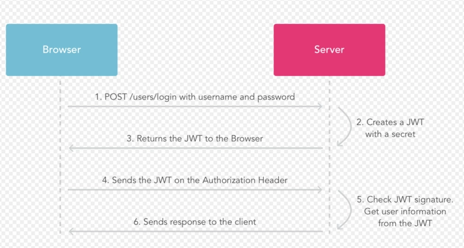

# JWT

## 1.JWT简介
  - ### JSON Web Token（JWT）是一个开放的标准（RFC 7519），它定义了一个紧凑且自包含的方式，用于在各方之间作为JSON对象安全地传输信息。由于此信息是经过数字签名的，因此可以被验证和信任。
  ## 2.JWT认证和session认证的区别
  - ### session认证
    - ### http协议是一种无状态的协议，而这就意味着如果用户向我们的应用提供了用户名和密码来进行用户认证，那么下一次请求时，用户还要再一次进行用户认证才行，因为根据http协议，我们并不能知道是哪个用户发送的请求，所以为了让我们的应用能识别是哪个用户发出的，我们只能在服务器存储一份用户登陆的信息，这份登陆信息会在响应时传递给浏览器，告诉其保存为cookie，以便下次请求时发送给我们的应用，这样我们的应用个就能识别请求来自哪个用户了，这就是传统的基于sessino认证。
  - ### JWT认证
    - #### 基于token的鉴权机制类似于http协议也是无状态的，它不需要在服务端去保留用户的认证信息或会话信息。这也就意味着JWT认证机制的应用不需要去考虑用户在哪一台服务器登录了，这就为应用的扩展提供了便利。
  ## 3.JWT认证流程
        
   - ### 认证流程如下：
      - #### 1.用户使用账号和密码发出post请求；
      - #### 2.服务器使用私钥创建一个jwt；
      - #### 3.服务器返回这个jwt给浏览器；
      - #### 4.浏览器将该jwt串在请求头中向服务器发送请求；
      - ####  5.服务器验证该jwt；
      - #### 6.返回响应的资源给浏览器。
  ## 4.JWT组成
  - ### 头部(Header)
    - #### JWT的头部有两部分信息：
      - #### 声明类型，这里是JWT
      - #### 声明加密的算法，通常直接使用HMAC SHA256
  - ### 载荷(payload)
    - #### 该部分一般存放一些有效的信息。JWT的标准定义包含五个字段：
      - #### iss：该JWT的签发者
      - #### sub: 该JWT所面向的用户
      - #### aud: 接收该JWT的一方
      - #### exp(expires): 什么时候过期，这里是一个Unix时间戳
      - #### iat(issued at): 在什么时候签发的
  - ### 签名(signature)
    - #### 前面两部分都是使用Base64进行编码的，即前端可以解开知道里面的信息。signature 需要使用编码后的header和payload以及我们提供的一个密钥，然后使用header中指定的签名算法（HS256）进行签名。签名的作用是保证 JWT 没有被篡改过。
    - #### 注意：密钥就是用来进行JWT的签发和JWT的验证，所以，它就是你服务端的私钥，在任何场景都不应该泄露出去。
    ## 5.JWT使用场景
      - #### JWT主要使用场景如下：
        - #### 授权
        - #### 信息交换：JSON
